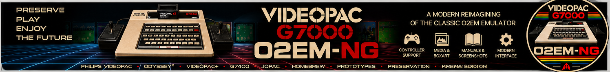

# O2EM-NG



A Windows x64, SDL3-based continuation of the original O2EM emulator for
Philips Videopac G7000 / G7400 and Magnavox Odyssey².

**Upcoming release: v0.31.0-beta - Beta 4.**
The latest published release is [v0.30.0-beta (Beta 3)](https://github.com/bengtovepeltz-design/O2EM-NG/releases/tag/v0.30.0-beta).
Beta 3 is being prepared for community testing; this README is not a publication announcement.

[Downloads](https://github.com/bengtovepeltz-design/O2EM-NG/releases) |
[Quick start](Beta_4_v0.31.0_Quick%20start%20guide.md) |
[Changelog](CHANGELOG.md) |
[Project notes](Project.md)

## What's new in Beta 4

- C7010 Chess with a separate NSC800/Z80-compatible module and firmware support.
- Corrected move-coordinate handling: the wrong source square is no longer cleared
  in the reproduced E2-E4 case.
- Stable chess-board rendering in local testing, with the earlier disappearing
  pieces, lower-board clipping and flicker addressed.
- Several moves, computer replies and a pawn capture tested successfully by the
  developer. Full games and special moves remain community-testing targets.
- Detailed chess diagnostics off by default; important error messages retained.
- A program icon based on the O2EM-NG emblem and automated Release packaging.

## Features

- Game Library, launcher, favorites and editable game information.
- Supplied SQLite game catalogue with titles, descriptions and metadata. Recognized
  ROMs such as `vp_01.bin` populate the library with the matching information.
- Import Center for user-supplied ROMs, box art, PDF manuals and screenshots.
- SDL3 video, audio, keyboard, mouse and Xbox-compatible controller support.
- Fullscreen/windowed operation, Settings, Auto/PAL/NTSC region selection.
- Two-controller gameplay and in-game controller-port swapping.

The catalogue is included; game ROMs, BIOS/firmware and cover/media files are not.
Media appears when the user supplies matching files.

## Getting started

1. Download an available release and install it or extract its portable ZIP.
2. Add your compatible console BIOS to `BIOS` and games to `ROMS`.
3. Run `O2EM-NG.exe`, select the console BIOS in Settings and choose a game.
4. Add optional artwork, manuals and screenshots through the Import Center.

The portable Beta 4 package includes SDL3, SDL3_image, SDL3_ttf, PDFium and the
required Microsoft C++ runtime DLLs beside the executable. Windows system runtime
components are still required. Keep the whole extracted folder together.

### C7010 Chess

In addition to the console BIOS, supply:

```text
BIOS/C7010/c7010_z80.bin   (8 KiB module firmware)
ROMS/vp_C7010.bin         (chess cartridge)
```

Start with **1 -> Y/YES -> 2** to play white at beginner level 2, then enter a move
such as **E2-E4** and press Enter. **N/NO** selects black and reverses the board.
Level **1** is tournament mode, not the easiest level; longer thinking time there
is expected. Exact hardware timing has not been established.

## Controls

| Action | Keyboard | Xbox-compatible controller |
| --- | --- | --- |
| Select in frontend | Enter | A |
| Navigate frontend | Arrow keys | D-pad / left stick |
| Reset game | F5 | B |
| Return from game to frontend | Esc | Back / View |
| Swap joystick ports | - | Y |

Chess setup and moves use the keyboard. Keyboard Y/YES and controller Y have different roles.

## Beta testing

Please test longer chess games, captures, castling, en passant, promotion, both
colours and console configurations. Ordinary-game regression testing is also welcome.
Earlier releases were tested with games including Gunfighter, Atlantis, Golf,
Munchkin and Bowling-Basketball; this is not a fresh compatibility certification
for every title in Beta 3. Four in 1 Row remains a previously recorded issue pending retest.

Reports should include version, Windows version, game/ROM name, console BIOS,
region, startup choices, exact moves or reproduction steps, and screenshots/video.
Do not attach BIOS or ROM files. Use [GitHub issues](https://github.com/bengtovepeltz-design/O2EM-NG/issues)
or the community beta discussion.

## Building and packaging

Open the Visual Studio solution/project and build **Release | x64**. SDK paths
currently refer to the developer's installed SDL libraries; adjust them for your machine.
The build creates a versioned folder and ZIP under `dist` from the explicit list in
`tools/release-manifest.json`. The supplied game catalogue is included; private
configuration and user ROM/media folders are not copied.

See [Release packaging](Release%20packaging.md) for file selection and installer building.
Debug builds do not create distribution packages. Detailed C7010 tracing is opt-in
with the build definition `O2EM_C7010_TRACE=1`.

## Credits and licensing

O2EM-NG builds on the original O2EM work by **Daniel Boris, Andre de la Rocha and
Arlindo M. de Oliveira**. SDL3 modernization, frontend integration and ongoing
O2EM-NG development: **Bengt-Ove Peltz**.

See [COPYRIGHTS.txt](COPYRIGHTS.txt) for the project licence and retained notices.
BIOS files, C7010 firmware, commercial ROMs, commercial manuals and copyrighted
artwork are not distributed. Users supply their own legally obtained files.
